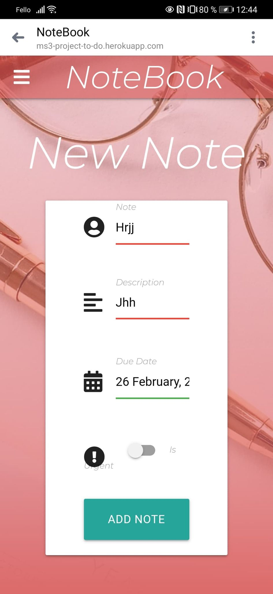
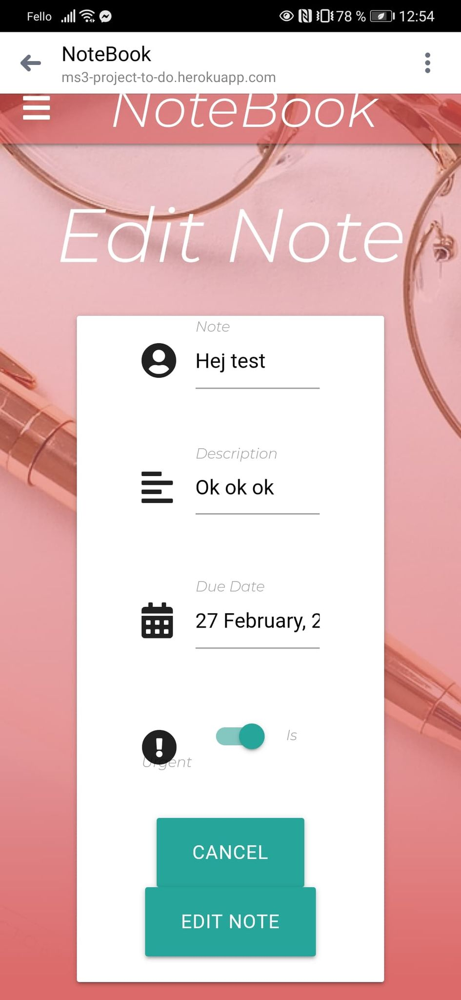
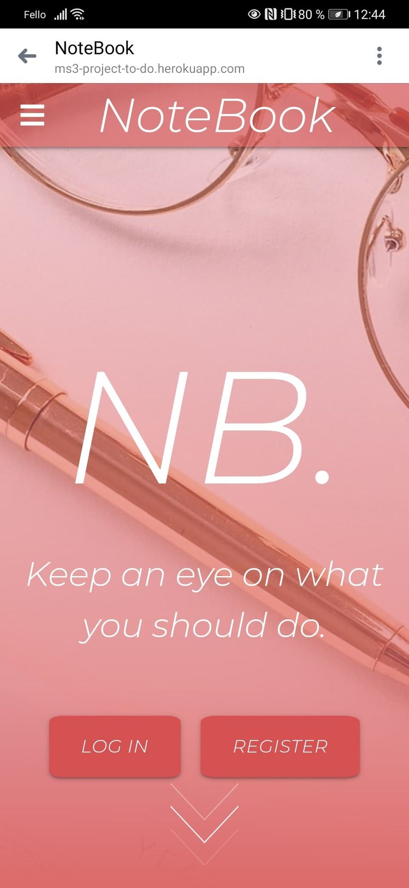

# MS3-PROJECT-NoteBook

---

[View the live project here](https://ms3-project-to-do.herokuapp.com/)

---

# Table of contents

* [Inspiration](#Inspiration)
* [UX](#UX)
* [Features](#features)
* [Screenshots](#screenshots)
* [Design](#design)
* [Testing](#testing)
* [Technologies](#technologies)
* [Credits](#credits)
* [Deployment](#deployment)
* [Contact](#Contact)

---

## Inspiration

---

## User Experiance (UX)

## User stories

*  First Time Visitor Goals

    * As a First Time Visitor, I want to easily understand the main purpose of the site.
    * As a First Time Visitor, I want to be able to easily navigate throughout the site to find content.
    * As a First Time Visitor,I want to be able to visit the website on every device, so that I can look at the website on desktop, mobile and tablet.
    * 

* Returning Visitor Goals
    * As a Returning Visitor, I want to find the best way to get in contact with the creator with any questions I may have.
    * As a Returning Visitor
    * As a Returning Visitor

*  Frequent User Goals
    * As a Frequent User
    * As a Frequent User
    * As a Frequent User

## Features

* Existing Features
    * Design
        * An attractive and simple layout.
        * Simple navigation throughout the website by using the navigation bar.
    
    * General
        * There are links to the social media platforms at the bottom of the website.
        * A contactform for people to contact me.
    
    * Register, login and logout
        * User can create a new account on the web application.
        * User can login with their existing accounts.
        * User can easily log out.
        * If a user creates a new account, logs in or logs out, a flashed message will appear with the action the person has done.
        * The password is saved in mongo db with a random password generated which make the password secury for the user.

    * Feature ideas to Implement
        * The user can delete their profile.
        * Display a nice profile page for the user.
        * Make a calender that you can put the notes in.

---

# Testing

### My methods for testing my webpage consisted of:

* Chrome DevTools is used to detect problems and test responsiveness.
* W3C Markup Validation Service
    * The W3C Markup Validation Service is used to check whether there were any errors in the HTML5 code.
* W3C CSS validator
    * The W3C CSS validator is used to check whether there were any errors in the CSS3 code.
* PEP8
    * The PEP8 validator is used to check whether there were any errors in the Python code.

* In the future I plan to implement automated tests.

### Testing User Stories from UX Section

##  First Time Visitor Goals

* As a First Time Visitor, I want to easily understand the main purpose of the site
* When I visit this site for the first time, I want to be able to easily navigate throughout the site to find content.
    - At the top of the page there is a navigation bar, each link describes what the page contents of.
* When I visit this site for the first time, I want to get a professional presentation of the person which the site is created by.
    - I've done a lot of bug testing to make sure that the user is left with a site that is well-working.
    - I went for a clean look that doesn't contain irrelevant information or annoying colors and images.

## Returning Visitor Goals

* As a Returning Visitor, I want to come back and edit, create notes.
* As a Returning Visitor, I want to find the best way to get in contact with the organisation with any questions I may have.
* As a Returning Visitor, I want to find community links.

##  Frequent User Goals

## Here is some examples of bugs that I encounterd during testing:

### Screenshots

---

# Technologies

### Languages Used
* [HTML5](https://sv.wikipedia.org/wiki/HTML5)
* [CSS3](https://en.wikipedia.org/wiki/CSS)
* [JQuery](https://sv.wikipedia.org/wiki/JQuery)
* [Python](https://en.wikipedia.org/wiki/Python_(programming_language))

### Design

* #### Colour Scheme
    * The two main colours used for my website is rgba coral, and white for the text.

* #### Typography
    * The Montserrat font is the main font used throughout the whole website. Montserrat is a clean font used frequently in programming, so it is both attractive and appropriate.

* #### Imagery
    * Imagery is important. The large, background hero image is designed to be striking and catch the user's attention. It also has a modern, energetic aesthetic.

* #### Wireframes
    * Home Page Wireframe
    * Mobile Wireframe
    * Contact Us Page Wireframe

### Frameworks, Libraries & Programs Used

* Materialize:
    * Materialize was used to assist with the responsiveness and styling of the website.
* Photoshop:
    * Photoshop was used to create the picture on the devices.
* Google Fonts:
    * Google fonts were used to import the 'Montserrat' font into the style.css file which is used on all pages throughout the project.
* GitHub:
    * GitHub is used to store the projects code after being pushed from Git.
* Git:
    * Git was used for version control by utilizing the Gitpod terminal to commit to Git and Push to GitHub.
* Gitpod:
    * GitPod is used to develop the project.
* MongoDB:
    * MongoDB is the fully managed cloud database service used for the project.
* Heroku:
    * Heroki is the platform to deploying the app.
* Flask:
    * Flask is the web framework used to provide libraries, tools and technologies for the app.
* Werkzeug:
    * Werkzeug is used for password hashing and authentication and autohorization.

---

## Deployment
--- 
### Requirements
* Python3
* Github account
* MongoDB account
* Heroku account

### Clone the project
To make a local clone, follow the steps:

1. Log in to GitHub and go to the repository.
2. Click on the green button with the text “Code”.
3. Click on “Open with GitHub Desktop” and follow the prompts in the GitHub Desktop Application or follow the instructions from [this link](https://docs.github.com/en/github/creating-cloning-and-archiving-repositories/cloning-a-repository#cloning-a-repository-to-github-desktop) to see how to clone the repository in other ways.

### Working with the local copy

1. Install all the requirements: Go to the workspace of your local copy. In the terminal window of your IDE type: pip3 install -r requirements.txt.
2. Create a database in MongoDB
    * Signup or login to your MongoDB account.
    * Create a cluster and a database.
    * Create four collections in the db: categories, recipes, subscribers, users.
    * Add string values for the collections.
3. Create the environment variables
    * Create a .gitignore file in the root directory of the project.
    * Add the env.py file in the .gitignore.
    * Create the file env.py. This will contain all the envornment variables.
    
            Import os
            os.environ.setdefault("IP", "Added by developer")
            os.environ.setdefault("PORT", "Added by developer")
            os.environ.setdefault("SECRET_KEY", "Added by developer")
            os.environ.setdefault("MONGO_URI", "Added by developer")
            os.environ.setdefault("MONGO_DBNAME", "Added by developer")
    
4. Run the app: Open your terminal window in your IDE. Type python3 app.py and run the app.

### Heroku Deployment

1. Set up local workspace for Heroku
    * In terminal window of your IDE type: pip3 freeze -- local > requirements.txt. (The file is needed for Heroku to know which filed to install.)
    * In termial window of your IDE type: python app.py > Procfile (The file is needed for Heroku to know which file is needed as entry point.)
2. Set up Heroku: create a Heroku account and create a new app and select your region.
3. Deployment method 'Github'
    * Click on the Connect to GitHub section in the deploy tab in Heroku.
        * Search your repository to connect with it.
        * When your repository appears click on connect to connect your repository with the Heroku.
    * Go to the settings app in Heroku and go to Config Vars. Click on Reveal Config Vars.
        * Enter the variables contained in your env.py file. it is about: IP, PORT, SECRET_KEY, MONGO_URI, MONGO_DBNAME
4. Push the requirements.txt and Procfile to repository.

        $ git add requirements.txt
        $ git commit -m "Add requirements.txt"

        $ git add Procfile 
        $ git commit -m "Add Procfile"
5. Automatic deployment: Go to the deploy tab in Heroku and scroll down to Aotmatic deployments. Click on Enable Automatic Deploys. By Manual deploy click on Deploy Branch.

- Heroku will receive the code from Github and host the app using the required packages. Click on Open app in the right corner of your Heroku account. The app wil open and the live link is available from the address bar.
---

# Credits

## Content

* On the home page i found a nice arrow with shows the visitors that theres more content on the page when you scroll down
    * [Link - Codepen](https://codepen.io/postor/pen/mskxI)
* The background image that i have on all pages
    * [Picture - Pixabay](https://pixabay.com/sv/photos/skrivbordet-white-flatlay-kontor-3820634/)
* On the Profile page Profile picture
    * [Picture - Pixabay](https://pixabay.com/sv/vectors/tom-profilbild-mysteriet-m%C3%A4nniskan-973460/)
* To display error handlers pages in a nice way i choose this picture
    * [Picture - Pixabay](https://pixabay.com/sv/illustrations/bakgrund-r%C3%B6d-textur-sprickor-gamla-182474/)
* The video i looked at to get it right with the error handling
    * [Video - Youtube](https://www.youtube.com/watch?v=mBKKZN1MMBM)
* Icon i use in the header
    * [Icon - Iconfinder](https://www.iconfinder.com/iconsets/office-222)

## Acknowledgements

Thanks to the following people and organizations who helped or inspired me for the project:

* My Mentor for continuous helpful feedback.
* Tutor support at Code Institute for their support.
* The lessons and knowledge of [Code Institute](https://codeinstitute.net/).
---

## Contact

E-mail: Linus.loof96@gmail.com

